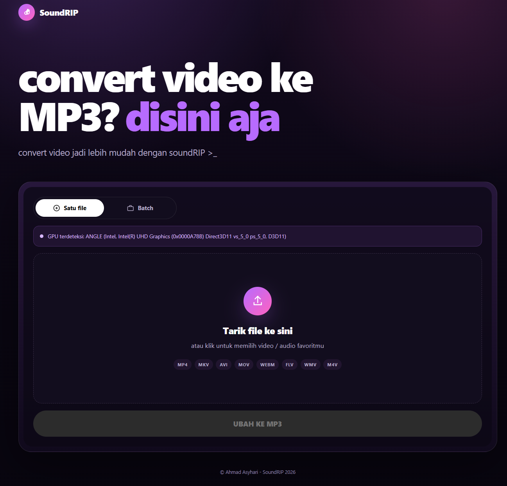

# Apa itu SoundRIP?

<p>
  
</p>

SoundRIP adalah aplikasi web statis untuk mengonversi audio dari file video ke format MP3. Seluruh proses berlangsung secara lokal di laptop anda sendiri, file tidak diunggah ke server manapun, tidak memerlukan akun, dan dapat dibuka tanpa koneksi internet setelah halaman dimuat. Jadi tenang aja, datamu tidak akan di kirim ke luar!

## Fitur

- Konversi lokal ke MP3 dengan pilihan bitrate 96–320
- Pilihan keluaran stereo atau mono
- Mendukung Format `MP4 MKV AVI MOV WEBM FLV WMV M4V`
- Bisa convert dalam bentuk batch (lebih dari satu file)

## Mau mengakses?
Klik [SoundRIP Pages](https://andros38.github.io/SoundRIP/)
atau bisa copy link dibawah ini :
```text
https://andros38.github.io/SoundRIP/
```

## Mau menyimpan halaman offline di laptop tanpa harus akses?
bisa kok, download aja file `index.html` yang ada di source code

## Hal yang perlu diingat!
Web ini sepenuhnya mengandalkan spesifikasi Laptop karena proses pengkodean sepenuhnya dilakukan offline di perangkat pengguna. Jadi jika proses convertnya lambat, mungkin spesifikasi anda kurang memadai sehingga membutuhkan waktu.

## Rekomendasi Spesifikasi
- Processor Intel & Ryzen (Sebisa mungkin diatas Tipe U)
- Jika memiliki Dedicated GPU akan lebih baik
- Minimal ram sebesar 4GB-8GB

## Untuk informasi lebih lanjut, bisa lihat pada file :
[SECURITY.md](SECURITY.md) dan [THIRD_PARTY_NOTICES.md](THIRD_PARTY_NOTICES.md)
